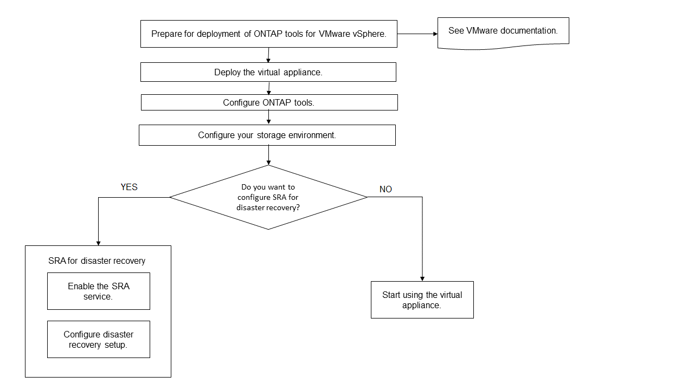

= Fluxo de trabalho de implantação para novos usuários de ferramentas do ONTAP para VMware vSphere
:allow-uri-read: 
:icons: font
:imagesdir: ../media/

[role="lead"]
Se você é novo na VMware e nunca usou um produto de ferramentas do NetApp ONTAP, precisará configurar o vCenter Server e configurar um host ESXi antes de implantar e configurar as ferramentas do ONTAP.

